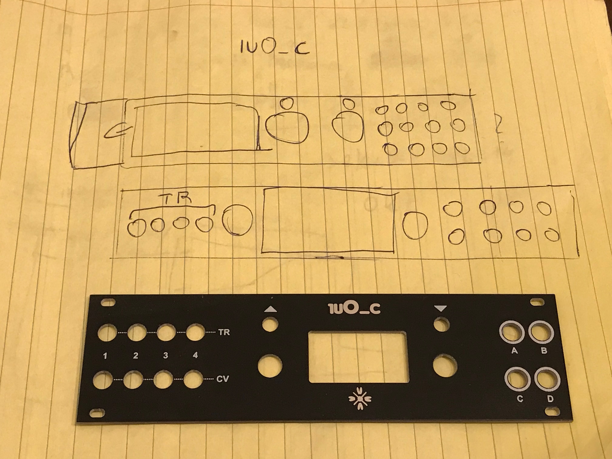

1u Version (Pulp Logic) of Ornament & Crime, 30HP.

For pcb's and panels: https://pushermanproductions.com/product/plum-audio-1u-ornament-crime-pcb-and-aluminium-panel/

Teensy Assembling (with Supervisor):https://youtu.be/IDsQhNgkL-Y

OLED Screen Assembling: https://youtu.be/ywh_6SPNrSg 

** Note for Pusherman v1.1 Pcb's - There is minor silk screen mistake - The Inputs and Outputs not numberd correctly. 

      
